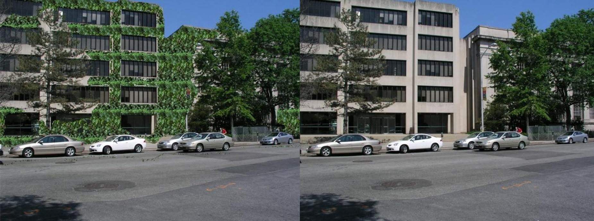

    

    An AI powered solution for sustainable cooling of Singapore for Hackfest 2022.

---

## What is bushierbrows?
*bushierbrows* is a an integrated advisory tool for building owners to identify optimal vertical greenery solutions for energy and cost saving measures through ML visual overlays.  

    
    
    
    

Use bushierbrows to capture / upload building profiles to our ML models, to obtain optimal overlay of vertical greenery, potential energy and cost savings. It is climate sensitive, changing its calculations based on its the expected climate, and also recommends Vertical Green System vendors around an area for a quick price estimate.

* Devpost submission: https://devpost.com/software/bushier-brows
* Video: https://www.youtube.com/watch?v=rcOqZ1RdERk
* Deck: https://drive.google.com/file/d/1WZpnFAX_BIkb1kRx8kTX09pqAQFZYPdl/view

## Tech stack

    

Other parts of the solution:

* Segmentation training/serving submodule: https://github.com/rehohoho/mmsegmentation
* Depth-estimation serving submodule: https://github.com/rehohoho/AdaBins
* Firebase functions submodule: https://github.com/rehohoho/bushier2_firebase_functions/

## Setup
See flutter documentation for installation and setting up of projects at https://docs.flutter.dev/get-started/install. Clone this repository and open as project.

## Models

1) Segmentation (tflite): [https://drive.google.com/file/d/1R-i3crOrCDVMEhaeZT66y_2X30yUCpWw/view?usp=sharing](https://drive.google.com/file/d/1R-i3crOrCDVMEhaeZT66y_2X30yUCpWw/view?usp=sharing)
2) Depth-estimation: [https://drive.google.com/drive/folders/1nYyaQXOBjNdUJDsmJpcRpu6oE55aQoLA?usp=sharing](https://drive.google.com/drive/folders/1nYyaQXOBjNdUJDsmJpcRpu6oE55aQoLA?usp=sharing)

## Sample results

    

    

    

